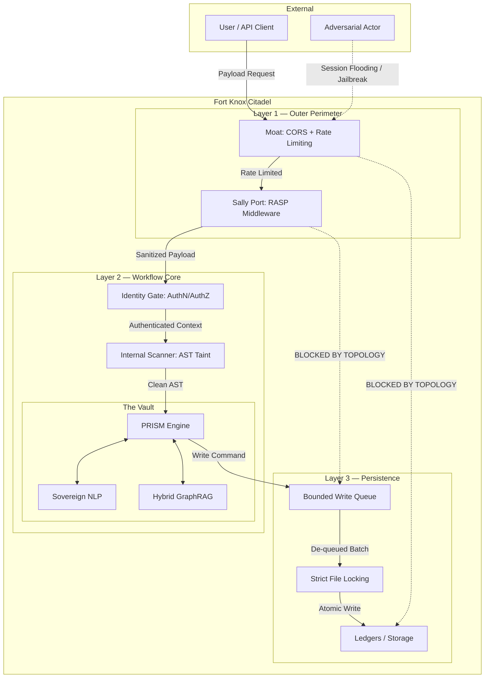

# Architectural Blueprint and Security Paradigm for the Praxis AI Orchestration Engine

## A Digital Fort Knox

---

## 1. Executive Introduction and Architectural Imperative

The deployment of autonomous multi-agent systems and Large Language Models (LLMs) into
enterprise production environments has fundamentally redefined the modern attack surface.
Unlike traditional deterministic software, where vulnerabilities are largely confined to
logic flaws in static code, AI-driven architectures process stochastic, natural language
inputs that act simultaneously as **data and executable instructions**. This paradigm shift
renders conventional perimeter defense models—such as static Web Application Firewalls (WAFs)
and basic input validation—catastrophically obsolete. Adversaries exploit the semantic
flexibility of LLMs through advanced vectors including indirect prompt injections, payload
inflation, and Abstract Syntax Tree (AST) manipulation, effectively turning the cognitive
engine into a vector for Remote Code Execution (RCE) and data exfiltration.

To counter this existential threat, the **Praxis** open-source AI orchestration and decision
engine is engineered upon an architectural methodology that anticipates catastrophic failure
and human malice. The design philosophy of Praxis is conceptualized through the operational
metaphor of a modern, digital **"Fort Knox."** It is not merely an application shielded by
a single monolithic wall; it is a **hyper-segmented, zero-trust facility**. In this citadel,
every layer mandates distinct cryptographic keys, every payload undergoes deep runtime
inspection, and the core decision-making vaults are technologically isolated from external
infrastructure.

By synthesizing **Hexagonal Architecture (Ports and Adapters)** with strict **trilateral
layer governance**, Praxis mathematically guarantees a **"Fail-Closed"** posture.
Furthermore, the internal execution engine is entirely sovereign, relying on a localized
**PRISM** (Analyzer, Selector, Critic) multi-agent framework, **Zero-External-Dependency
Natural Language Processing (NLP)**, and **Hybrid Graph Retrieval-Augmented Generation
(GraphRAG)**. This comprehensive blueprint details the topological foundations, the
five-stage defensive axioms, and the cognitive mechanics that render Praxis an impregnable
orchestration engine.

---

## 2. The Topological Foundation: Hexagonal Architecture and Strict Layer Governance

To achieve the absolute isolation required for a digital Fort Knox, Praxis discards
traditional layered monolithic architectures, which are prone to privilege escalation
and horizontal lateral movement. Instead, the foundation relies on a strict implementation
of **Hexagonal Architecture**, widely recognized in enterprise system design as the
**Ports and Adapters** pattern.

### 2.1 Protocol-Based Port Contracts and Domain Isolation

The fundamental principle of Hexagonal Architecture is the absolute decoupling of the
application's core business logic—the AI orchestration engine—from all external
infrastructure, including databases, user interfaces, third-party APIs, and external
event buses.

In the Praxis architecture, the core domain logic resides at the insulated center of the
hexagon. It exposes its capabilities strictly through **"Ports"**, which are
technology-agnostic, protocol-based interfaces defining exact input and output contracts.
External actors on the "driving side" (such as a REST API accepting user queries) or the
"driven side" (such as an outbound connection to an embedding model or graph database) must
translate their specific technological implementations through **"Adapters"** that rigidly
conform to these Ports.

This ensures that the core decision engine remains entirely oblivious to the nature of its
external dependencies. If a user interface is compromised or a persistent database is
swapped, the internal cognitive logic remains physically untouched; only the adapter is
altered. This creates a **mathematical abstraction layer** that protects the core and
isolates it from external vectors.

### 2.2 Strict Trilateral Layer Governance

To enforce memory safety and prevent state corruption, Praxis mandates strict layer
governance across three distinct zones: **Presentation, Workflow, and Persistence**. The
foundational, non-negotiable rule of this governance is that **the Presentation layer MUST
NOT communicate directly with Persistence**.

| Architectural Layer | Fort Knox Analogue | Role in Praxis | Governance Rules |
|---|---|---|---|
| **Presentation** (Outer Adapter) | The Moat & Sally Port | Handles all incoming external I/O: REST/GraphQL queries, API endpoints, UIs, and external webhooks. | Only permitted to route sanitized payloads to the Workflow layer via strictly typed inbound Ports. Completely barred from executing queries, accessing vector stores, or writing to disk. |
| **Workflow** (The Domain Core) | The Vault | Contains the PRISM orchestration engine, state management, Multi-Agent pipelines, and business rules. | Validates all state transitions. Receives data from Presentation, orchestrates internal agents, processes NLP, and invokes Persistence adapters via outbound Ports. |
| **Persistence** (Inner Adapter) | The Ledgers | Manages database transactions, vector stores, knowledge graphs (Neo4j), and local file systems. | Only accepts transactional commands from the Workflow layer. Executes bounded read/write operations and strictly enforces local file-locking semantics. |

By enforcing this trilateral isolation, an adversary who successfully breaches the
Presentation layer via an injection attack **cannot directly manipulate the Persistence
layer**. The architectural topology physically lacks the routing mechanisms for such
commands, neutralizing entire classes of database-focused exploits before they are
conceptualized.

---

## 3. Visualizing the Fort Knox Topology

---

## 4. The 5 Security Axioms: The "Fort Knox" Breakdown

Praxis assumes a fundamental **"Fail-Closed"** philosophy. This ideology dictates that
the system inherently distrusts all inputs and state transitions. If any individual
component fails to mathematically verify a payload or cryptographic signature, the entire
transaction is immediately aborted, local memory is purged, and the system reverts to a
closed defensive posture.

### 4.1 Axiom 1: The Moat (Outer Perimeter Defenses)

Before a payload even interacts with application code, it must cross the **Moat**. This
perimeter is defined by a **strictly empty default CORS allowlist** and **aggressive
dynamic rate limiting**.

In cloud-native AI architectures, adversaries frequently employ **session flooding
attacks**—such as HTTP GET/POST flooding (Excessive VERB attacks) and asymmetric resource
exhaustion. By sending a high rate of session connection requests containing nested,
computationally expensive logic, attackers seek to overwhelm the orchestration engine's
memory and CPU, triggering an Application-Layer DDoS.

**Praxis Implementation:**
- Zero-Trust continuous verification and edge-level request thresholding
- Any origin request not explicitly hardcoded in the deployment configuration is
  immediately rejected via the empty CORS policy
- Traffic is subjected to ingress filtering and hop-count verification
- If a specific IP, token, or subnet exceeds a baseline request rate, the connection
  is forcibly dropped at the transport layer

### 4.2 Axiom 2: The Sally Port (RASP Inspection Checkpoints)

If a request successfully traverses the Moat, it enters the **Sally Port**, where
**Runtime Application Self-Protection (RASP)** middleware is deployed. Traditional WAFs
inspect static network traffic for known regex signatures, which is profoundly inadequate
for securing LLMs where encoded payloads or natural language manipulation can bypass
static filters entirely. RASP, conversely, is a security integration embedded directly
within the application's runtime environment, possessing deep, contextual visibility into
data processing, variable assignments, and actual code execution.

**Praxis Implementation:**
- RASP middleware intercepts all POST/PUT/PATCH bodies at the application layer
- Detects direct and indirect prompt injections, jailbreak patterns, and role
  manipulation
- Enforces dynamic upper limits on query depth, aliases, and batch sizes via AST
  analysis
- Three operational modes: `enforce` (block), `log` (alert only), `off` (disabled)
- Exempt prefixes for controlled code-analysis endpoints (`/safeguards/`)

### 4.3 Axiom 3: Identity Gates (Biometric Scanners)

Once the payload's structural integrity and execution intent are verified by RASP, it
reaches the **Identity Gates**. Operating under a Secure Access Service Edge (SASE) and
Zero-Trust framework, the engine treats every device, user, and internal microservice as
untrusted until mathematically verified.

**Praxis Implementation:**
- Every action mapped to the Workflow layer requires an explicit cryptographic token
  (JWT with ephemeral validity)
- Tokens evaluate current grid topology, user roles, and rule satisfaction
- Principle of Least Privilege enforcement prevents local privilege escalation and
  lateral movement

### 4.4 Axiom 4: Internal Scanners (AST Security and Taint Propagation)

Even heavily authenticated payloads from trusted users can harbor obfuscated malicious
logic. The internal **Contraband Scanners** utilize Abstract Syntax Tree (AST) tracking
and **Taint Analysis** to mathematically map "taint propagation"—tracing how untrusted
user input flows through variables, method returns, data collections, and object
assignments.

**Praxis Implementation:**
- AST scanner parses the structural codebase of incoming payloads prior to memory
  execution
- Detects alias-chaining, unsafe object deserialization, and malicious method overrides
- Establishes "source" (user input) and monitors the dependency graph toward potential
  "sinks" (dangerous execution functions like SQL execution or OS commands)
- If tainted, unsanitized data reaches a sink, triggers critical alert and drops
  execution

### 4.5 Axiom 5: The Vault Safeguards (Persistence Protection)

The deepest layer of Praxis is the **Vault**, representing the Persistence adapters.

**Praxis Implementation:**
- **Bounded Write Queues**: Hard memory limit (`maxsize=10,000`). If the queue reaches
  capacity, it spills over to disk or refuses further connections
- **Strict File-Locking**: Once a Workflow thread opens a state file for writing, it is
  categorically inaccessible to other users or adversarial threads until the operation
  achieves atomic completion
- Mitigates race conditions and prevents "Last Delete-On-Close" manipulations

---

## 5. The Execution Layer Engine: Cognitive Operations Within the Vault

### 5.1 The PRISM Agentic Framework

The core reasoning loop of Praxis utilizes the **PRISM** (Parallel Reward Integration and
Selector Mechanism) framework, an advanced agentic retrieval and AI orchestration system.

| Agent | Role | Objective |
|---|---|---|
| **Question Analyzer** | Primary Planner | Decomposes complex multi-hop queries into discrete, tractable sub-questions. Maps causal requirements, variable relationships, and structural dependencies. |
| **The Selector** | Quality Control | Evaluates candidate evidence retrieved from internal data stores. Aggressively filters out irrelevant, noisy, or distracting context. Maximizes precision. |
| **The Critic** | Feedback Loop | Evaluates intermediate responses and rationales. Rejects logical fallacies, contradictions, or hallucinations. The **Adder** component maximizes recall by requesting further retrieval. |

This explore-critic paradigm leverages mathematical subadditivity; the interaction between
agents ensures that redundant exploration is minimized while the reliability of information
feedback is maximized. By iterating this loop *N* times, PRISM dramatically reduces
epistemic uncertainty, mitigates error propagation, and produces highly verifiable semantic
outputs.

### 5.2 Sovereign, Zero-External-Dependency NLP

A true digital Fort Knox cannot rely on external cloud APIs for core text processing, as
this introduces severe supply chain vulnerabilities, violates compliance parameters (FERPA,
HIPAA), and presents unacceptable data exfiltration risks.

**Praxis executes all NLP locally:**
- Named Entity Recognition (NER)
- Part-of-speech tagging and dependency parsing
- Semantic relation extraction
- Subject-predicate-object triple extraction
- Entity clustering and disambiguation

### 5.3 Hybrid Graph Retrieval-Augmented Generation (GraphRAG)

Traditional RAG systems (VectorRAG) rely purely on vector databases for semantic
similarity. Hybrid GraphRAG mathematically unifies both paradigms:

1. **Ingestion Phase**: Zero-dependency NLP extracts entities → stored in graph database
   (Neo4j). Embedding model generates vectors → stored in vector store (Chroma/FAISS).

2. **Retrieval Phase**: Dual retrieval — Graph Retrieval (Cypher/SPARQL) for explicit
   multi-hop relationships + Vector Retrieval for broad semantic coverage.

3. **Aggregation**: Results merged through context aggregation, providing PRISM agents
   with layered insights fusing factual graph-based knowledge with semantic nuance.

---

## 6. Threat Mitigation Matrix

| Adversarial Behavior | Attack Vector | Praxis Countermeasure | Defense Layer |
|---|---|---|---|
| **Session Flooding** | High-rate HTTP GET/POST to exhaust memory/CPU | Edge-level dynamic rate limiting, ingress filtering, Zero-Trust SASE | Axiom 1: The Moat |
| **Query Payload Inflation** | Deep circular GraphQL queries, excessive aliases | RASP AST analysis enforcing dynamic upper limits on depth/aliases | Axiom 2: Sally Port |
| **Prompt Injection** (Direct/Indirect) | Malicious instructions in prompts or linked documents | Deep runtime inspection of prompt strings and execution paths | Axiom 2: Sally Port |
| **AST Alias-Chaining** | Recursive alias definitions hiding malicious logic | Taint propagation from source to sink through execution graph | Axiom 4: Internal Scanners |
| **Memory Corruption / Race Conditions** | Exploiting concurrent writes or file lock bypasses | Mandatory file-locking semantics and bounded write queues | Axiom 5: The Vault |
| **Hallucination Cascades** | LLM generating incorrect data contaminating downstream tasks | PRISM Critic agent evaluates intermediate outputs against GraphRAG evidence | PRISM Engine |

---

## 7. Data Flow Narrative: Penetrating the Layers

**Query Scenario**: An enterprise user submits: *"Generate a comprehensive compliance risk
report for the new Q3 vendor onboarding protocol, referencing internal network guidelines."*

| Step | Component | Action |
|---|---|---|
| 1 | **Outer Perimeter** (Moat) | Validate CORS origin, assess rate parameters, pass if within threshold |
| 2 | **RASP** (Sally Port) | Inspect payload for jailbreak heuristics, encoded manipulation, inflation attempts |
| 3 | **Identity Gate** | Verify cryptographic SASE token, confirm `Compliance_Read` AuthZ access |
| 4 | **AST Scanner** | Taint propagation analysis ensuring no alias-chaining or unsafe deserialization |
| 5 | **PRISM Analyzer** | Deconstruct into sub-queries: vendor protocols, network guidelines, compliance risks |
| 6 | **Hybrid GraphRAG** | Dual retrieval — vector search for "Q3 vendor" + graph traversal for entity relationships |
| 7 | **Selector + Critic** | Filter outdated policies, validate claims against source data, trigger re-retrieval if needed |
| 8 | **Persistence** | Log transaction via bounded queue → file-lock → atomic write to disk |
| 9 | **Egress** | Verified compliance report transmitted back through outbound Presentation port |

---

## 8. Conclusion

The Praxis orchestration engine represents a fundamental paradigm shift in the security
architecture of autonomous artificial intelligence systems. By abandoning perimeter-only
defense models and embracing the absolute isolation principles of Hexagonal Architecture,
Praxis structurally eliminates the most catastrophic attack vectors facing modern LLM
applications.

The integration of RASP middleware, dynamic AST taint propagation analysis, and strict
persistence locking mechanisms ensures that malicious payloads—whether delivered through
prompt injection, payload inflation, or logic mutation—are decisively neutralized before
they can corrupt the deterministic workflow. Furthermore, by housing cognitive capabilities
entirely within local, sovereign bounds—utilizing the PRISM multi-agent framework, Hybrid
GraphRAG, and zero-external-dependency NLP—Praxis guarantees that data privacy and factual
grounding are maintained without sacrificing analytical depth or multi-hop reasoning.

In an era where adversarial capabilities evolve at the speed of generative algorithms, the
Praxis blueprint provides a mathematically rigorous, fail-closed citadel capable of
sustaining secure, enterprise-grade AI orchestration at scale.
